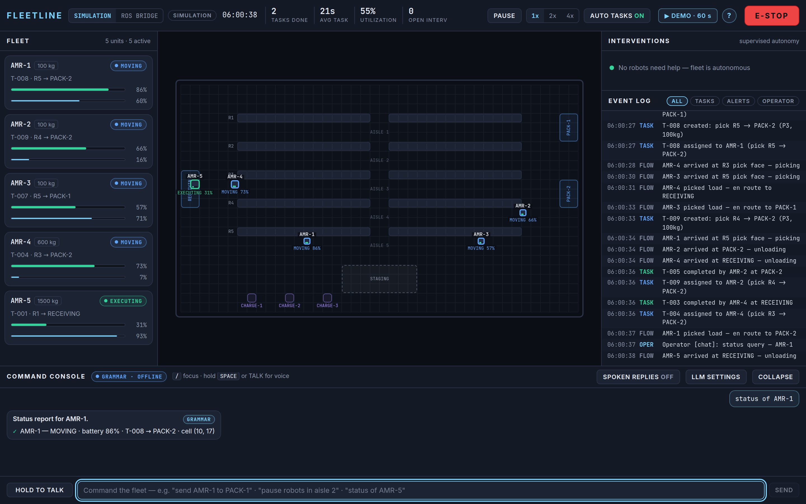
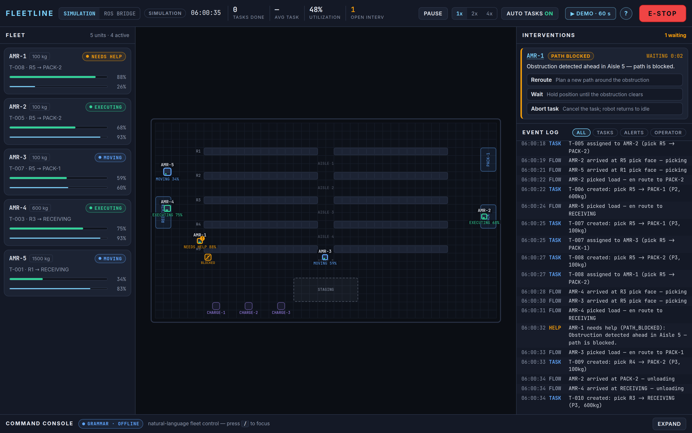
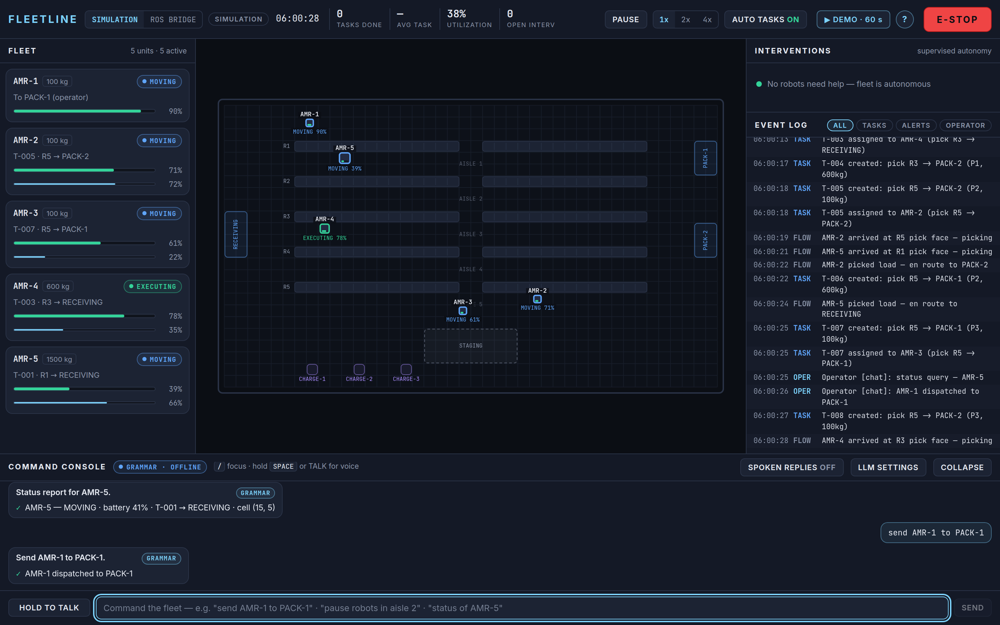
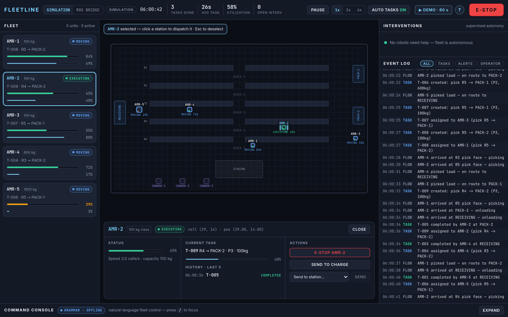
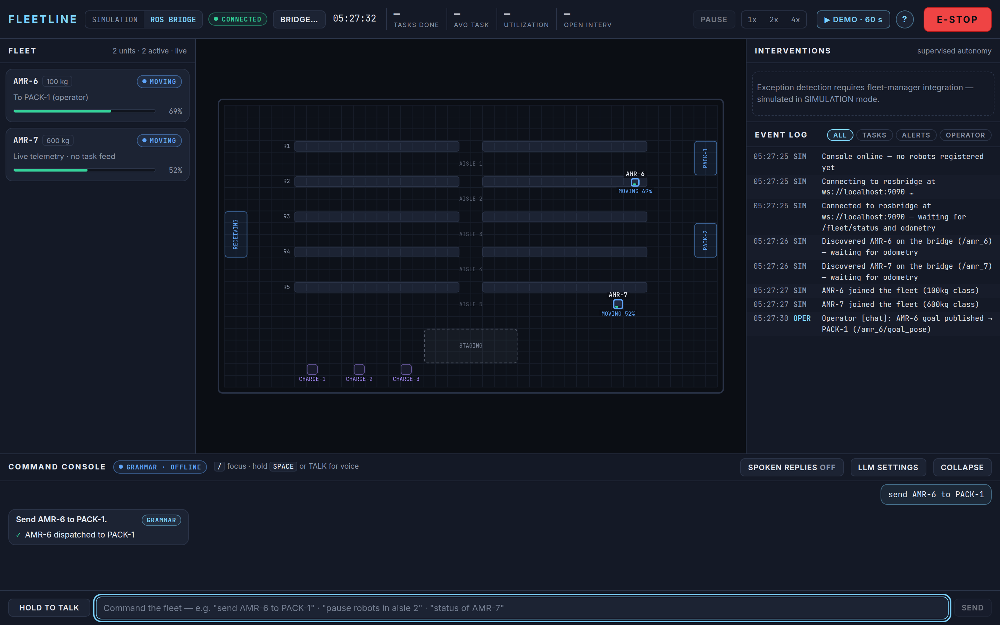
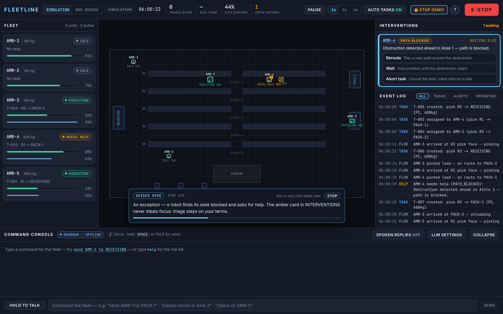
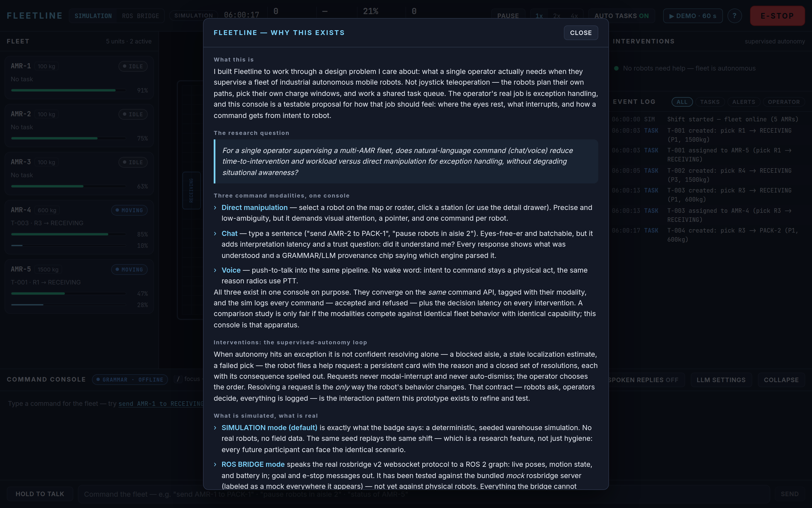
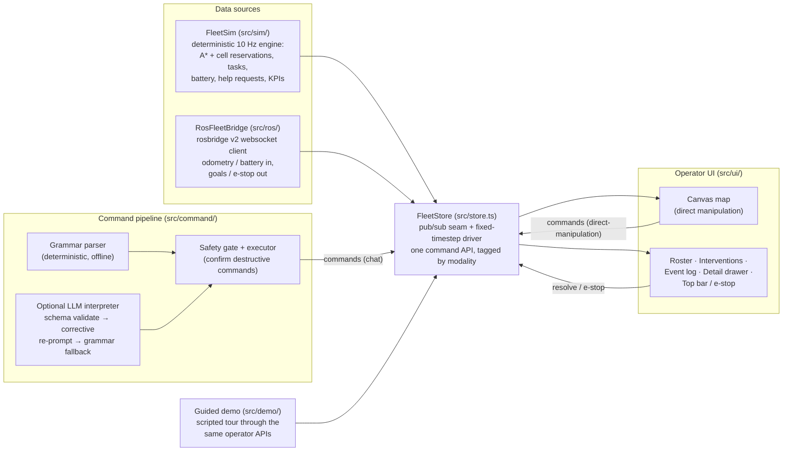

# Fleetline — an operations console for industrial AMR fleets



Fleetline is a design-research prototype of the screen a single operator uses to
supervise a fleet of industrial autonomous mobile robots (AMRs) in a warehouse.
The robots plan their own paths, balance their own charging, and work a shared
task queue — the operator's real job is **exception handling**: a robot that
found its aisle blocked, a robot no longer sure where it is, a robot that failed
a pick twice. Fleetline treats that supervised-autonomy loop — *robots ask,
operators decide, everything is logged* — as the core design object, and builds
three competing command modalities (direct manipulation, typed chat, push-to-talk
voice) into one console so their interaction costs can be compared honestly.

Everything on screen is driven by a deterministic, seeded simulation and the UI
says so on its face; an opt-in **ROS BRIDGE** mode takes live robot data from a
ROS 2 graph over the standard rosbridge websocket protocol instead.

## The research question

> For a single operator supervising a multi-AMR fleet, does natural-language
> command (chat/voice) reduce time-to-intervention and workload versus direct
> manipulation for exception handling, without degrading situational awareness?

The console is the study apparatus: both command arms converge on the same
command API, every command is logged with its modality — accepted **and
refused** — and every intervention records decision latency. The session
protocol, measures, and analysis plan live in the research kit in the companion
repository. **Evaluation status: [Evaluation designed; sessions pending]** — no
participant data has been collected, and nothing in this repository is a study
result.

## Feature tour

### Supervised-autonomy interventions



When autonomy hits an exception it can't confidently resolve, the robot files a
**help request**: a persistent card with the reason, elapsed waiting time, and a
closed set of resolutions, each with its consequence spelled out (*Reroute /
Wait / Abort task*…). Requests never modal-interrupt and never auto-dismiss;
the operator chooses the order. One fact is encoded four ways at four sizes —
card in the queue, amber robot on the map, chip in the roster, KPI in the top
bar — so "does anything need me?" is a single glance. Resolving a request is
the *only* way the robot's behavior changes, and the decision latency lands in
the event log.

### Natural-language command console



The bottom dock takes typed or spoken commands — `send AMR-2 to PACK-1`,
`pause robots in aisle 2`, `status of AMR-5` — through one pipeline: interpret
→ clarify if ambiguous → confirm if destructive → execute through the exact
command API the map uses. Every response restates what was understood and
carries a provenance chip (GRAMMAR or LLM) naming the engine that parsed it.
Ambiguity comes back as a question with clickable canonical answers;
unparseable input gets a clickable list of real commands, never a shrug. Voice
is push-to-talk (hold the button or hold Space) — no wake word, so intent to
command stays a physical act.

### Direct manipulation and the robot drawer



Click a robot (map or roster) to select it; click a station to dispatch it.
The detail drawer docks over the map bottom — the map rescales above it, so no
robot is ever hidden — and carries the deep dive: battery, current task and
progress, last-five task outcomes, per-robot e-stop, and a station picker that
is the keyboard-reachable twin of clicking the map. The global E-STOP is
deliberately asymmetric: engaging is one un-confirmed click; releasing takes an
explicit two-step confirm, because restarting a moving fleet is the
consequential action.

### ROS 2 bridge mode



A DATA SOURCE switch in the top bar swaps the deterministic sim for a live
connection to a ROS 2 graph over the rosbridge v2 JSON protocol: per-robot
`nav_msgs/Odometry` and `sensor_msgs/BatteryState` in, `geometry_msgs/PoseStamped`
goals and `std_msgs/Bool` e-stop out, roster discovery via a `/fleet/status`
topic. Discovered robots join the roster, map, and command vocabulary the
moment they appear. The switch is honest in both directions: everything the
bridge cannot claim (task KPIs, exception detection) goes dark *with the reason
stated*, and commands with no plain-topic equivalent are refused with an
explanation. See [`docs/ROS2.md`](docs/ROS2.md) for the topic map and a real
TurtleBot3 + Nav2 setup guide.

### Guided demo and rationale panel



The **▶ DEMO · 60 s** button plays a scripted tour — tasks spawn, the fleet
dispatches, a help request fires and is auto-resolved, a chat command types
itself through the real parser, the e-stop slams and releases — with narration
captions and a progress bar. The demo has no special powers: every action goes
through the same operator APIs as the buttons, and the script's timing and
sequence are unit-tested against the real simulation. Esc or any interaction
hands control back instantly.



The **?** button opens the rationale panel: what this prototype is, the research
question, why three command modalities share one console, and an explicit
account of what is simulated versus real.

## Architecture



The sim is plain TypeScript with no React imports — no `Date.now()`, no
`Math.random()`; all randomness flows through one seeded stream, so a given
seed reproduces the exact same shift (a research feature: every future study
participant can face an identical scenario). The store is the single seam:
React subscribes at tick granularity via `useSyncExternalStore`, the canvas
reads the sim directly each frame with render-side interpolation, and both
command modalities and the ROS bridge converge on the same command wrappers.

## Run it

```bash
npm install
npm run dev        # console on the deterministic simulation (default)
npm test           # vitest — sim, store, command pipeline, ROS bridge, guided demo
npm run build      # typecheck + production build
```

ROS bridge mode without a robot in sight — a **clearly-labeled mock** rosbridge
server with two patrolling robots ships in `tools/`:

```bash
npm run mock-ros   # MOCK rosbridge server on ws://localhost:9090
# then open:
http://localhost:5173/?source=ros&bridge=ws://localhost:9090
```

Useful URL parameters (all optional):

| Param | Effect |
| --- | --- |
| `?demo=1` | auto-play the 60-second guided demo on load |
| `?source=ros` | start in ROS BRIDGE mode |
| `&bridge=ws://host:9090` | rosbridge websocket URL |
| `&robots=amr_1,amr_2` | pre-register robot namespaces (skip `/fleet/status` discovery) |
| `&cellm=0.5&originx=22&originy=13` | world→grid transform for a real map (see `docs/ROS2.md`) |

Against a real ROS 2 system: point the bridge URL at a running
`rosbridge_server` — [`docs/ROS2.md`](docs/ROS2.md) documents the expected
topics and an honest tested-vs-untested statement.

## Keyless by default, LLM optional

With no API key configured, the command console runs entirely on its built-in
**deterministic grammar parser** — same sentence, same action, every time,
fully offline. Pasting a Gemini API key into LLM SETTINGS (stored in
localStorage only; requests go directly from the browser) switches to LLM-first
interpretation: the model may only propose JSON against a strict schema, a
hand-rolled validator checks every field against the live warehouse vocabulary,
one corrective re-prompt is sent on failure, and any second failure or network
error falls back to the grammar parser — labeled as such in the response
bubble. The deterministic floor is the default on purpose: fleet control wants
reproducibility, demos must not require keys, and the study protocol needs
identical parsing for every participant.

## Design decisions (short version)

- **Grammar-first parsing, LLM as an option — not the reverse.** A closed
  grammar is testable, instant, free, and offline; a model is a distribution.
  The LLM mode exists because looser phrasing is exactly the trust question the
  modality study cares about — but it is layered on a deterministic floor, and
  the provenance chip tells the operator which engine interpreted them.
- **Confirmation friction is placed by interpretation risk, not by habit.** The
  physical E-STOP button is one click, never confirmed — a button press is
  unambiguous intent. A *parsed sentence* (above all a voice transcript)
  carries interpretation risk, so destructive commands arriving through
  language (`e-stop all`, `clear e-stop`, `abort task`) get an inline
  consequence-first confirm. Stale confirms are superseded by newer commands so
  a forgotten CONFIRM button can never fire minutes later.
- **Provenance chips on every interpretation.** An operator deciding how much
  to trust "Send AMR-2 to PACK-1." deserves to know whether a deterministic
  grammar or a language model produced it. GRAMMAR/LLM chips make the engine
  visible at the moment of trust, not in a settings page.
- **E-stop recovery friction.** Stopping is instant; resuming requires
  RELEASE → CONFIRM (with an auto-disarm timeout). The consequential action is
  the one that makes robots move again.
- **Refusals are data.** A robot that declines a command ("AMR-5 is carrying a
  load") logs the refusal with its modality, because where each modality
  invites errors is a primary study measure — silent no-ops would destroy it.
- **Help requests are triage, not modals.** Persistent, comparable,
  interruptible-by-choice cards instead of focus-stealing dialogs — the map
  must stay visible at exactly the moment the operator decides.

Longer rationale — including rejected alternatives (continuous-space sim,
central multi-agent planner, roslibjs, Foxglove panel, wake-word voice, table
roster, modal interventions) — is in the working notes that accompany the
project's case study.

## Honest limitations

- **The simulation is a design instrument, not a physics model.** Grid-based
  motion with cell reservations, fixed pick/drop durations, compressed battery
  pacing, and probabilistic exception injection. It produces *plausible,
  repeatable* fleet behavior to design against — it does not predict the
  throughput of a real deployment.
- **The ROS bridge has been tested against a mock, not hardware.** The client
  speaks the public rosbridge v2 protocol and its integration tests run against
  the bundled mock server (protocol-faithful, loudly labeled a mock). A real
  Gazebo/TurtleBot3 run is documented but not yet performed; known gaps (odom
  vs. map frame, Nav2 action interface) are listed in `docs/ROS2.md`.
- **The evaluation has not run yet.** The instrumentation and protocol exist;
  the sessions do not. `[Evaluation designed; sessions pending]` — every claim
  in this README is about the artifact, not about measured operator
  performance.
- **Single-operator, five-robot scale.** The card roster and one-glance layout
  are designed for this scale; at 50+ robots a filterable/by-exception roster
  wins (noted in the working notes as the intended evolution).

## Repository map

```
src/sim/        deterministic warehouse simulation (pure TS, no React)
src/store.ts    pub/sub store + fixed-timestep driver + command API seam
src/ui/         operator console components (top bar, roster, map, panels…)
src/canvas.ts   canvas renderer + hit testing for the warehouse map
src/command/    grammar parser, optional LLM interpreter, safety gate, executor
src/ros/        rosbridge client, ROS↔console bridge, coordinate transform
src/demo/       guided-demo script (unit-tested against the sim) + runner
tools/          mock rosbridge server (labeled mock; for demos and tests)
docs/           ROS2.md setup guide, README screenshots
```

`window.__fleetStore` is exposed in the browser console for scripted runs and
debugging, e.g. `__fleetStore.sim.injectHelpRequest('AMR-2', 'PATH_BLOCKED')`
or `__fleetStore.sim.commandLog`.

## Changelog (build stages)

1. **Simulation engine + warehouse view** — grid warehouse, A* with
   cell-reservation deconfliction, task queue + assignment policy, battery and
   charging, probabilistic help requests, per-robot/global e-stop, KPI
   accumulators, seeded determinism; canvas view at 60 fps over a 10 Hz fixed
   timestep.
2. **Operator console** — control-room layout (roster / map / interventions +
   log), click-to-command direct manipulation, detail drawer, two-step e-stop
   release, command instrumentation with modality tags and decision-latency
   logging.
3. **Command pipeline** — natural-language console (typed + push-to-talk
   voice), deterministic grammar parser with fuzzy station matching and
   clarification questions, optional BYO-key LLM mode with schema validation /
   corrective re-prompt / grammar fallback, inline confirms for destructive
   commands, provenance chips.
4. **ROS 2 bridge** — hand-rolled rosbridge v2 client with reconnect + registry
   replay, robot discovery, world→grid transform, honest capability degradation
   in live mode, mock server + protocol integration tests, `docs/ROS2.md`.
5. **Polish + guided demo** — 60-second scripted tour (unit-tested against the
   sim), about/rationale panel, self-hosted fonts (fully offline), responsive
   fixes down to 1280×800, final screenshot set.
